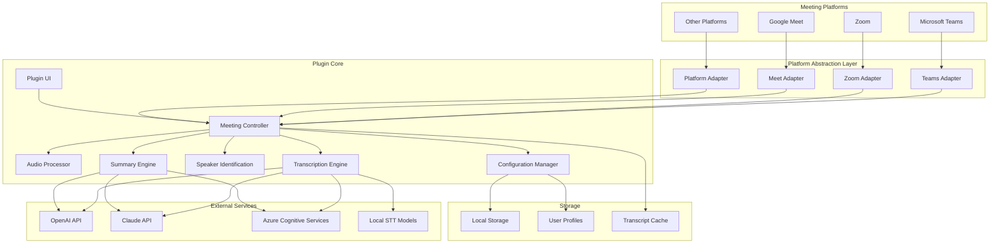

# Design Document

## Overview

The Universal Meeting Transcription Plugin is a cross-platform solution that provides real-time speech-to-text transcription, speaker identification, and AI-powered meeting summaries for multiple video conferencing platforms including Microsoft Teams, Zoom, Google Meet, and others. The plugin uses a platform abstraction layer to integrate with different meeting platforms and leverages configurable STT services (local models or cloud APIs) for transcription and AI services for intelligent summarization.

The system follows a modular architecture with clear separation between platform integration, audio capture, transcription processing, speaker identification, and summary generation. It supports both privacy-focused local processing and cloud-based services for enhanced accuracy.

## Architecture

### High-Level Architecture



### Component Architecture

The plugin follows a layered architecture with platform abstraction:

1. **Platform Integration Layer**: Adapters for different meeting platforms (Teams, Zoom, Meet, etc.)
2. **Presentation Layer**: Cross-platform UI and user controls
3. **Business Logic Layer**: Core transcription and processing logic
4. **Service Layer**: External API integrations and local model interfaces
5. **Data Layer**: Local storage and configuration management

### Platform Abstraction Strategy

The plugin uses a platform adapter pattern to support multiple video conferencing platforms:

**Implementation Approaches**:
1. **Browser Extension**: Works across all web-based platforms (Teams web, Zoom web, Google Meet)
2. **Desktop Application**: Integrates with desktop clients using screen capture and system audio
3. **Platform-Specific Plugins**: Native integrations where APIs are available

**Platform Detection**: Automatically detects the current meeting platform and loads the appropriate adapter.

## Components and Interfaces

### 0. Platform Adapter Interface

**Purpose**: Provides a unified interface for different video conferencing platforms.

**Key Responsibilities**:
- Detect meeting state (start/end/participants)
- Capture audio streams
- Access meeting metadata (agenda, participants)
- Send messages to chat (where supported)
- Handle platform-specific authentication

**Interface**:
```javascript
// Platform Adapter Class
class PlatformAdapter {
  detectPlatform() { /* returns platform type */ }
  async getMeetingInfo() { /* returns meeting details */ }
  async getAudioStream() { /* returns MediaStream */ }
  async getParticipants() { /* returns participant array */ }
  async sendMessageToChat(message) { /* returns success boolean */ }
  async getMeetingAgenda() { /* returns agenda or null */ }
  async isHost() { /* returns host status */ }
}

// Platform Types
const MeetingPlatform = {
  TEAMS: 'teams',
  ZOOM: 'zoom',
  GOOGLE_MEET: 'google_meet',
  WEBEX: 'webex',
  UNKNOWN: 'unknown'
};

// Meeting Info Structure
const meetingInfoSchema = {
  id: 'string',
  title: 'string', 
  platform: 'string',
  startTime: 'Date',
  participants: 'array',
  agenda: 'object|null'
};
```

**Platform-Specific Implementations**:

1. **Teams Adapter**: Uses Teams JavaScript SDK for native integration
2. **Zoom Adapter**: Uses Zoom Web SDK or desktop app integration
3. **Google Meet Adapter**: Uses browser extension APIs for web integration
4. **Generic Adapter**: Uses system audio capture and screen scraping for unsupported platforms

### 1. Meeting Controller

**Purpose**: Orchestrates the entire transcription workflow and manages meeting lifecycle across platforms.

**Key Responsibilities**:
- Monitor meeting state across different platforms (start/end/participants)
- Coordinate audio capture and transcription
- Manage speaker identification
- Trigger summary generation
- Handle chat integration (where supported by platform)
- Manage platform-specific features and limitations

**Interface**:
```javascript
// Meeting Controller Class
class MeetingController {
  async initializePlatform(platform) { /* setup platform adapter */ }
  async startTranscription() { /* begin transcription */ }
  async stopTranscription() { /* end transcription */ }
  async pauseTranscription() { /* pause transcription */ }
  async resumeTranscription() { /* resume transcription */ }
  async sendTranscriptToChat() { /* returns success boolean */ }
  async generateSummary() { /* returns summary string */ }
  getPlatformCapabilities() { /* returns capabilities object */ }
}

// Platform Capabilities Structure
const platformCapabilities = {
  supportsChatIntegration: true,
  supportsAgendaAccess: true,
  supportsParticipantInfo: true,
  supportsHostDetection: true,
  audioQuality: 'high' // 'high' | 'medium' | 'low'
};
```

### 2. Audio Processor

**Purpose**: Captures and preprocesses audio from Teams meetings.

**Key Responsibilities**:
- Interface with Teams audio streams
- Audio quality assessment
- Audio segmentation for processing
- Noise reduction and enhancement

**Interface**:
```typescript
interface IAudioProcessor {
  startCapture(): Promise<MediaStream>;
  stopCapture(): void;
  getAudioSegment(duration: number): Promise<AudioBuffer>;
  assessQuality(audio: AudioBuffer): QualityMetrics;
}
```

### 3. Transcription Engine

**Purpose**: Converts audio to text using configured STT services.

**Key Responsibilities**:
- Route audio to appropriate STT service
- Handle service-specific API calls
- Manage transcription confidence scores
- Batch processing for efficiency

**Interface**:
```typescript
interface ITranscriptionEngine {
  transcribe(audio: AudioBuffer, config: STTConfig): Promise<TranscriptionResult>;
  setSTTProvider(provider: STTProvider): void;
  getAvailableProviders(): STTProvider[];
}

interface TranscriptionResult {
  text: string;
  confidence: number;
  segments: TranscriptionSegment[];
}
```

### 4. Speaker Identification System

**Purpose**: Identifies and tracks speakers throughout the meeting.

**Key Responsibilities**:
- Voice pattern analysis
- Speaker enrollment and recognition
- Handle overlapping speech
- Maintain speaker consistency

**Interface**:
```typescript
interface ISpeakerIdentification {
  identifySpeaker(audio: AudioBuffer): Promise<SpeakerResult>;
  enrollSpeaker(speakerId: string, audio: AudioBuffer[]): Promise<void>;
  getSpeakerProfiles(): SpeakerProfile[];
}

interface SpeakerResult {
  speakerId: string;
  confidence: number;
  isNewSpeaker: boolean;
}
```

### 5. Summary Engine

**Purpose**: Generates AI-powered meeting summaries based on agenda and transcript.

**Key Responsibilities**:
- Parse meeting agenda/schedule
- Apply user-specific prompts
- Generate structured summaries
- Handle multiple AI service providers

**Interface**:
```typescript
interface ISummaryEngine {
  generateSummary(transcript: Transcript, agenda: MeetingAgenda, userPrompt?: string): Promise<Summary>;
  setAIProvider(provider: AIProvider): void;
  saveUserPrompt(userId: string, prompt: string): Promise<void>;
}
```

### 6. Configuration Manager

**Purpose**: Manages user preferences, API keys, and plugin settings.

**Key Responsibilities**:
- Store user configurations
- Manage API credentials
- Handle service provider settings
- Maintain user-specific prompts

**Interface**:
```typescript
interface IConfigurationManager {
  getUserConfig(userId: string): Promise<UserConfig>;
  saveUserConfig(userId: string, config: UserConfig): Promise<void>;
  getSTTConfig(): STTConfig;
  getAIConfig(): AIConfig;
}
```

## Data Models

### Core Data Structures

```typescript
interface Transcript {
  meetingId: string;
  startTime: Date;
  endTime?: Date;
  segments: TranscriptionSegment[];
  speakers: SpeakerProfile[];
  metadata: MeetingMetadata;
}

interface TranscriptionSegment {
  id: string;
  speakerId: string;
  text: string;
  startTime: number;
  endTime: number;
  confidence: number;
}

interface SpeakerProfile {
  id: string;
  name?: string;
  voiceprint: VoiceprintData;
  participantId?: string;
}

interface MeetingAgenda {
  items: AgendaItem[];
  meetingTitle: string;
  scheduledDuration: number;
}

interface AgendaItem {
  title: string;
  description?: string;
  estimatedDuration?: number;
  owner?: string;
}

interface Summary {
  meetingId: string;
  agendaItems: SummarizedItem[];
  actionItems: ActionItem[];
  keyDecisions: Decision[];
  generatedAt: Date;
  generatedBy: string;
}

interface UserConfig {
  sttProvider: STTProvider;
  aiProvider: AIProvider;
  customPrompt?: string;
  apiKeys: Record<string, string>;
  preferences: UserPreferences;
}
```

### Configuration Models

```typescript
enum STTProvider {
  LOCAL_WHISPER = 'local_whisper',
  OPENAI_WHISPER = 'openai_whisper',
  AZURE_SPEECH = 'azure_speech',
  CLAUDE_SPEECH = 'claude_speech'
}

enum AIProvider {
  OPENAI_GPT = 'openai_gpt',
  CLAUDE = 'claude',
  AZURE_OPENAI = 'azure_openai'
}

interface STTConfig {
  provider: STTProvider;
  apiKey?: string;
  endpoint?: string;
  model?: string;
  language: string;
}
```

## Error Handling

### Error Categories

1. **Audio Capture Errors**
   - Microphone access denied
   - Audio stream interruption
   - Poor audio quality

2. **Transcription Errors**
   - API rate limits
   - Network connectivity issues
   - Service unavailability
   - Authentication failures

3. **Speaker Identification Errors**
   - Insufficient audio samples
   - Overlapping speech
   - Background noise interference

4. **Summary Generation Errors**
   - Missing agenda information
   - API quota exceeded
   - Invalid custom prompts

### Error Handling Strategy

```typescript
interface ErrorHandler {
  handleAudioError(error: AudioError): Promise<void>;
  handleTranscriptionError(error: TranscriptionError): Promise<void>;
  handleSummaryError(error: SummaryError): Promise<void>;
  notifyUser(message: string, severity: ErrorSeverity): void;
}

enum ErrorSeverity {
  INFO = 'info',
  WARNING = 'warning',
  ERROR = 'error',
  CRITICAL = 'critical'
}
```

**Graceful Degradation**:
- Continue transcription with reduced accuracy if speaker ID fails
- Provide basic transcript if summary generation fails
- Fall back to local processing if cloud services are unavailable
- Cache audio locally if real-time processing fails

## Testing Strategy

### Unit Testing
- Individual component testing with mocked dependencies
- Audio processing pipeline validation
- Configuration management testing
- Error handling verification

### Integration Testing
- Teams SDK integration testing
- STT service integration validation
- AI service integration testing
- End-to-end workflow testing

### Performance Testing
- Audio processing latency measurement
- Memory usage optimization
- Concurrent user handling
- Large meeting scalability

### User Acceptance Testing
- Host control functionality
- Participant experience validation
- Summary quality assessment
- Configuration usability testing

### Test Data Strategy
- Synthetic meeting audio generation
- Various accent and language samples
- Different meeting sizes and durations
- Edge case scenario simulation

## Technology Stack

### Frontend Technologies

**Core Framework**:
- **React 18+**: Component-based UI framework for cross-platform compatibility
- **JavaScript (ES6+)**: Modern JavaScript with async/await and modules
- **Node.js 18+**: Server-side JavaScript runtime
- **Webpack 5**: Module bundling and build optimization

**Browser Extension Stack**:
- **Manifest V3**: Modern Chrome extension architecture
- **WebExtensions API**: Cross-browser compatibility (Chrome, Firefox, Edge)
- **Content Scripts**: Inject functionality into meeting platforms
- **Background Service Workers**: Handle persistent operations

**UI/UX Libraries**:
- **Material-UI (MUI)**: Consistent design system
- **React Hook Form**: Form management and validation
- **Framer Motion**: Smooth animations and transitions
- **React Query**: Data fetching and caching

### Backend/Core Technologies

**Audio Processing**:
- **Web Audio API**: Browser-based audio manipulation
- **MediaRecorder API**: Audio stream recording
- **AudioWorklet**: Real-time audio processing
- **FFmpeg.js**: Audio format conversion and processing

**Local STT Models**:
- **Whisper.cpp**: Local OpenAI Whisper implementation
- **SpeechRecognition API**: Browser native speech recognition
- **TensorFlow.js**: Client-side ML model execution
- **ONNX.js**: Cross-platform ML inference

**Speaker Identification**:
- **WebRTC**: Audio stream analysis
- **TensorFlow.js**: Voice embedding models
- **Speaker-recognition libraries**: Voice fingerprinting
- **Audio feature extraction**: MFCC, spectrograms

### Cloud Services Integration

**STT Services**:
- **OpenAI Whisper API**: High-accuracy transcription
- **Azure Speech Services**: Enterprise-grade STT
- **Google Cloud Speech-to-Text**: Multi-language support
- **AWS Transcribe**: Real-time transcription

**AI/LLM Services**:
- **OpenAI GPT-4**: Advanced text summarization
- **Anthropic Claude**: Conversation analysis
- **Azure OpenAI**: Enterprise AI services
- **Google Vertex AI**: ML model serving

### Platform Integration SDKs

**Microsoft Teams**:
- **Teams JavaScript SDK**: Native Teams integration
- **Microsoft Graph API**: Meeting and calendar data
- **Teams App Framework**: App development platform

**Zoom**:
- **Zoom Web SDK**: Browser-based integration
- **Zoom REST API**: Meeting management
- **Zoom Webhooks**: Real-time event handling

**Google Meet**:
- **Google Meet Add-ons**: Native integration (limited)
- **Google Calendar API**: Meeting metadata
- **Chrome Extensions API**: Browser integration

### Data Storage & Management

**Local Storage**:
- **IndexedDB**: Browser-based structured storage
- **SQLite**: Desktop application database
- **LocalStorage**: Configuration and preferences
- **File System API**: Direct file access (where supported)

**Configuration Management**:
- **JSON Schema**: Configuration validation
- **Encryption libraries**: Secure credential storage
- **Environment variables**: API key management

### Development & Build Tools

**Development Environment**:
- **Node.js 18+**: JavaScript runtime and development platform
- **npm**: Package management and scripts
- **Teams Toolkit**: Microsoft's official Teams development toolkit
- **ESLint**: JavaScript linting and code standards
- **Prettier**: Code formatting
- **Nodemon**: Development server with hot reload

**Testing Framework**:
- **Jest**: Unit testing framework
- **React Testing Library**: Component testing
- **Playwright**: End-to-end testing
- **MSW (Mock Service Worker)**: API mocking

**Build & Deployment**:
- **GitHub Actions**: CI/CD pipeline
- **Docker**: Containerization for development
- **Electron Builder**: Desktop app packaging
- **Web Extension Polyfill**: Cross-browser compatibility

### Security & Privacy

**Encryption & Security**:
- **Web Crypto API**: Client-side encryption
- **bcrypt**: Password hashing
- **JWT**: Secure token management
- **HTTPS**: Secure communication

**Privacy Tools**:
- **Local-first architecture**: Minimize data transmission
- **Data anonymization**: Remove PII from transcripts
- **Secure deletion**: Proper data cleanup

### Platform-Specific Technologies

**Desktop Application (Electron)**:
```
├── Electron Main Process
├── Renderer Process (React)
├── Native Node.js modules
├── System audio capture
└── File system access
```

**Browser Extension**:
```
├── Content Scripts (Platform injection)
├── Background Service Worker
├── Popup UI (React)
├── Options Page
└── WebExtensions APIs
```

**Web Application**:
```
├── React SPA
├── Web Audio API
├── WebRTC
├── Service Workers
└── Progressive Web App features
```

### Architecture Layers

```
┌─────────────────────────────────────┐
│           User Interface            │
│        (React + JavaScript)         │
├─────────────────────────────────────┤
│        Platform Adapters            │
│      (Teams Primary Focus)          │
├─────────────────────────────────────┤
│         Core Services               │
│  (Audio, STT, Speaker ID, Summary)  │
├─────────────────────────────────────┤
│        External Integrations        │
│    (Cloud APIs, Local Models)       │
├─────────────────────────────────────┤
│         Data & Storage              │
│   (IndexedDB, SQLite, LocalStorage) │
└─────────────────────────────────────┘
```

## Platform-Specific Implementation Details

### Microsoft Teams (Primary Platform)

**Integration Approach**:
- **Teams App Framework**: Native Teams application using Teams Toolkit
- **Teams JavaScript SDK**: Access to meeting APIs and audio streams
- **Microsoft Graph API**: Meeting metadata and calendar integration
- **Bot Framework**: Optional bot integration for enhanced features

**Installation Methods**:

1. **Sideloading (Development/Testing)**:
   - Create Teams app package (.zip file with manifest.json)
   - Upload via Teams Admin Center or directly in Teams client
   - Requires developer permissions in organization
   - Best for testing and internal deployment

2. **Teams App Store (Production)**:
   - Submit app for Microsoft certification
   - Public distribution through Teams App Store
   - Requires Microsoft Partner Center account
   - Full compliance and security review

3. **Organization App Catalog**:
   - Deploy to organization's private app catalog
   - IT admin controls distribution
   - No Microsoft certification required
   - Best for enterprise deployment

**Teams App Structure**:
```
teams-transcription-app/
├── manifest.json          # Teams app manifest
├── package.json          # Node.js dependencies
├── src/
│   ├── client/           # React frontend
│   ├── server/           # Node.js backend (optional)
│   └── teams/            # Teams-specific code
├── assets/
│   ├── icon-outline.png  # App icon (outline)
│   └── icon-color.png    # App icon (color)
└── .env                  # Environment variables
```

**Required Permissions in manifest.json**:
```json
{
  "permissions": [
    "identity",
    "messageTeamMembers"
  ],
  "devicePermissions": [
    "media"
  ],
  "webApplicationInfo": {
    "id": "your-app-id",
    "resource": "https://graph.microsoft.com"
  }
}
```

**Audio Access**: Teams SDK provides direct access to meeting audio streams
**Chat Integration**: Native Teams chat API for sending transcripts
**Host Detection**: Teams SDK provides meeting role information

### Zoom
- **Integration**: Zoom Web SDK or Zoom App Marketplace
- **Audio Access**: Web SDK audio streams or system audio capture
- **Chat Integration**: Zoom chat API (where available)
- **Deployment**: Zoom App Marketplace or browser extension

### Google Meet
- **Integration**: Browser extension with Meet APIs
- **Audio Access**: WebRTC audio capture or system audio
- **Chat Integration**: Meet chat API (limited availability)
- **Deployment**: Chrome Web Store extension

### Generic/Fallback Approach
- **Integration**: Desktop application with system-level audio capture
- **Audio Access**: System audio routing (e.g., Virtual Audio Cable)
- **Chat Integration**: Manual copy/paste or file export
- **Deployment**: Standalone desktop application

### Platform Feature Matrix

| Feature | Teams | Zoom | Google Meet | Generic |
|---------|-------|------|-------------|---------|
| Native Audio Access | ✅ | ✅ | ⚠️ | ✅ |
| Chat Integration | ✅ | ✅ | ⚠️ | ❌ |
| Agenda Access | ✅ | ⚠️ | ❌ | ❌ |
| Host Detection | ✅ | ✅ | ⚠️ | ❌ |
| Participant Info | ✅ | ✅ | ⚠️ | ❌ |

✅ Full Support | ⚠️ Limited Support | ❌ Not Available

## Security and Privacy Considerations

### Data Protection
- Local encryption for stored transcripts
- Secure API key management
- User consent for cloud processing
- Data retention policies

### Access Control
- Host-only plugin activation
- Participant notification of recording
- Role-based feature access
- Audit logging for compliance

### Privacy Modes
- Local-only processing option
- Automatic data deletion
- Anonymization capabilities
- GDPR compliance features