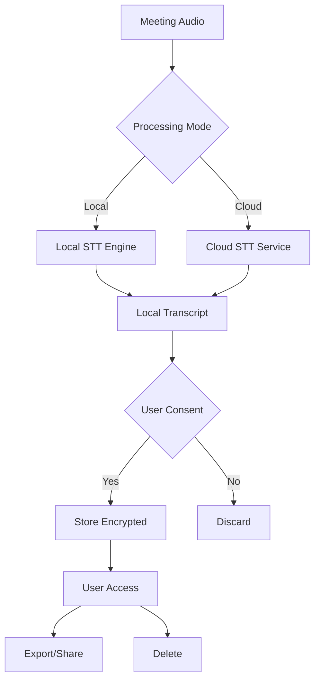

# Privacy and Security Documentation

## Overview

This document outlines the privacy and security measures implemented in the Teams Meeting Transcription Plugin, data handling practices, compliance considerations, and user controls for protecting sensitive information.

## Table of Contents

1. [Privacy Principles](#privacy-principles)
2. [Data Collection and Processing](#data-collection-and-processing)
3. [Security Architecture](#security-architecture)
4. [Encryption and Data Protection](#encryption-and-data-protection)
5. [User Privacy Controls](#user-privacy-controls)
6. [Compliance and Certifications](#compliance-and-certifications)
7. [Third-Party Services](#third-party-services)
8. [Data Retention and Deletion](#data-retention-and-deletion)
9. [Incident Response](#incident-response)
10. [Privacy by Design](#privacy-by-design)

## Privacy Principles

### Core Principles

1. **Data Minimization**: Collect only necessary data for transcription functionality
2. **Purpose Limitation**: Use data solely for meeting transcription and summary generation
3. **Transparency**: Clear disclosure of data practices and user controls
4. **User Control**: Comprehensive privacy settings and data management options
5. **Security by Default**: Strong security measures enabled by default
6. **Local Processing**: Option for complete local processing without cloud services

### Privacy-First Design

```
┌─────────────────────────────────────┐
│           User Control              │
│    (Consent, Settings, Deletion)    │
├─────────────────────────────────────┤
│         Local Processing            │
│      (Privacy Mode Available)       │
├─────────────────────────────────────┤
│        Data Encryption              │
│     (End-to-End Protection)         │
├─────────────────────────────────────┤
│       Minimal Data Collection       │
│    (Only Essential Information)     │
└─────────────────────────────────────┘
```

## Data Collection and Processing

### Types of Data Collected

**Audio Data:**
- Meeting audio streams (temporary processing only)
- Voice patterns for speaker identification (optional)
- Audio quality metrics

**Transcription Data:**
- Speech-to-text conversion results
- Speaker identification labels
- Confidence scores and timestamps

**Meeting Metadata:**
- Meeting ID and title
- Participant names (when available)
- Meeting duration and date
- Agenda information (when available)

**Configuration Data:**
- User preferences and settings
- API keys (encrypted)
- Custom prompts and templates

**Usage Analytics (Optional):**
- Feature usage statistics
- Performance metrics
- Error logs (anonymized)

### Data Processing Locations

**Local Processing Mode:**
```
┌─────────────────┐    ┌─────────────────┐    ┌─────────────────┐
│   User Device   │    │   Local Storage │    │   No External   │
│                 │───▶│                 │───▶│   Transmission  │
│ Audio → Text    │    │ Encrypted Data  │    │                 │
└─────────────────┘    └─────────────────┘    └─────────────────┘
```

**Cloud Processing Mode:**
```
┌─────────────────┐    ┌─────────────────┐    ┌─────────────────┐
│   User Device   │    │  Cloud Service  │    │   Local Storage │
│                 │───▶│                 │───▶│                 │
│ Audio Capture   │    │ STT Processing  │    │ Encrypted Data  │
└─────────────────┘    └─────────────────┘    └─────────────────┘
```

### Data Flow Diagram



## Security Architecture

### Multi-Layer Security Model

**Application Layer:**
- Input validation and sanitization
- XSS and CSRF protection
- Secure API communication
- Authentication and authorization

**Data Layer:**
- End-to-end encryption
- Secure key management
- Data integrity verification
- Access control mechanisms

**Transport Layer:**
- TLS 1.3 encryption
- Certificate pinning
- Secure WebSocket connections
- API rate limiting

**Storage Layer:**
- Encrypted local storage
- Secure key derivation
- Data anonymization
- Automatic cleanup

### Security Controls

```typescript
interface SecurityControls {
  encryption: {
    algorithm: 'AES-256-GCM';
    keyDerivation: 'PBKDF2';
    saltLength: 32;
    iterations: 100000;
  };
  
  authentication: {
    apiKeyEncryption: true;
    tokenExpiration: 3600;
    refreshTokens: true;
  };
  
  dataProtection: {
    inputValidation: true;
    outputSanitization: true;
    contentSecurityPolicy: true;
    crossOriginProtection: true;
  };
  
  monitoring: {
    auditLogging: true;
    anomalyDetection: true;
    intrusionDetection: true;
    securityAlerts: true;
  };
}
```

## Encryption and Data Protection

### Encryption Implementation

**Data at Rest:**
```typescript
class SecureStorageService {
  async encryptData(data: any, userKey: string): Promise<EncryptedData> {
    // Generate random salt
    const salt = crypto.getRandomValues(new Uint8Array(32));
    
    // Derive encryption key using PBKDF2
    const key = await crypto.subtle.deriveKey(
      {
        name: 'PBKDF2',
        salt: salt,
        iterations: 100000,
        hash: 'SHA-256'
      },
      await crypto.subtle.importKey('raw', userKey, 'PBKDF2', false, ['deriveKey']),
      { name: 'AES-GCM', length: 256 },
      false,
      ['encrypt']
    );
    
    // Generate random IV
    const iv = crypto.getRandomValues(new Uint8Array(12));
    
    // Encrypt data
    const encrypted = await crypto.subtle.encrypt(
      { name: 'AES-GCM', iv: iv },
      key,
      new TextEncoder().encode(JSON.stringify(data))
    );
    
    return {
      data: new Uint8Array(encrypted),
      salt: salt,
      iv: iv,
      algorithm: 'AES-256-GCM'
    };
  }
}
```

**Data in Transit:**
```typescript
class SecureAPIClient {
  constructor() {
    this.baseURL = 'https://api.example.com';
    this.timeout = 30000;
  }
  
  async makeSecureRequest(endpoint: string, data: any): Promise<any> {
    const response = await fetch(`${this.baseURL}${endpoint}`, {
      method: 'POST',
      headers: {
        'Content-Type': 'application/json',
        'Authorization': `Bearer ${await this.getSecureToken()}`,
        'X-API-Version': '2024-01-01',
        'X-Request-ID': crypto.randomUUID()
      },
      body: JSON.stringify(data),
      signal: AbortSignal.timeout(this.timeout)
    });
    
    if (!response.ok) {
      throw new SecurityError('API request failed', response.status);
    }
    
    return await response.json();
  }
}
```

### Key Management

**API Key Protection:**
```typescript
class APIKeyManager {
  private static readonly KEY_PREFIX = 'encrypted_api_key_';
  
  async storeAPIKey(provider: string, apiKey: string): Promise<void> {
    const userKey = await this.getUserEncryptionKey();
    const encryptedKey = await this.encryptionService.encrypt(apiKey, userKey);
    
    await this.secureStorage.setItem(
      `${APIKeyManager.KEY_PREFIX}${provider}`,
      encryptedKey
    );
    
    // Clear plaintext key from memory
    apiKey = '';
  }
  
  async getAPIKey(provider: string): Promise<string> {
    const encryptedKey = await this.secureStorage.getItem(
      `${APIKeyManager.KEY_PREFIX}${provider}`
    );
    
    if (!encryptedKey) {
      throw new Error('API key not found');
    }
    
    const userKey = await this.getUserEncryptionKey();
    return await this.encryptionService.decrypt(encryptedKey, userKey);
  }
}
```

## User Privacy Controls

### Privacy Settings Interface

```typescript
interface PrivacySettings {
  processingMode: 'local' | 'cloud' | 'hybrid';
  dataRetention: {
    transcripts: number; // days
    audioData: number;   // days (0 = immediate deletion)
    summaries: number;   // days
  };
  sharing: {
    allowChatIntegration: boolean;
    allowExport: boolean;
    requireConsent: boolean;
  };
  analytics: {
    allowUsageTracking: boolean;
    allowPerformanceMetrics: boolean;
    allowErrorReporting: boolean;
  };
  security: {
    encryptionEnabled: boolean;
    requireAuthentication: boolean;
    auditLogging: boolean;
  };
}
```

### Consent Management

```typescript
class ConsentManager {
  async requestConsent(meeting: MeetingInfo): Promise<ConsentResult> {
    const consentDialog = new ConsentDialog({
      meetingTitle: meeting.title,
      participants: meeting.participants,
      dataUsage: this.getDataUsageDescription(),
      retentionPeriod: this.getRetentionPeriod(),
      processingLocation: this.getProcessingLocation()
    });
    
    const result = await consentDialog.show();
    
    if (result.granted) {
      await this.recordConsent(meeting.id, result);
      this.auditLogger.log('consent_granted', {
        meetingId: meeting.id,
        timestamp: new Date(),
        consentDetails: result
      });
    }
    
    return result;
  }
  
  async revokeConsent(meetingId: string): Promise<void> {
    await this.deleteAllMeetingData(meetingId);
    await this.recordConsentRevocation(meetingId);
    
    this.auditLogger.log('consent_revoked', {
      meetingId: meetingId,
      timestamp: new Date()
    });
  }
}
```

### Data Subject Rights

**Right to Access:**
```typescript
class DataAccessService {
  async exportUserData(userId: string): Promise<UserDataExport> {
    const transcripts = await this.transcriptStorage.getUserTranscripts(userId);
    const settings = await this.configManager.getUserConfig(userId);
    const auditLogs = await this.auditLogger.getUserLogs(userId);
    
    return {
      transcripts: transcripts.map(t => this.anonymizeTranscript(t)),
      settings: this.sanitizeSettings(settings),
      auditLogs: auditLogs,
      exportDate: new Date(),
      format: 'JSON'
    };
  }
}
```

**Right to Deletion:**
```typescript
class DataDeletionService {
  async deleteAllUserData(userId: string): Promise<DeletionReport> {
    const deletionTasks = [
      this.deleteTranscripts(userId),
      this.deleteSettings(userId),
      this.deleteAPIKeys(userId),
      this.deleteAuditLogs(userId),
      this.deleteCachedData(userId)
    ];
    
    const results = await Promise.allSettled(deletionTasks);
    
    return {
      userId: userId,
      deletionDate: new Date(),
      itemsDeleted: results.filter(r => r.status === 'fulfilled').length,
      errors: results.filter(r => r.status === 'rejected').map(r => r.reason)
    };
  }
}
```

## Compliance and Certifications

### GDPR Compliance

**Legal Basis for Processing:**
- Consent: User explicitly consents to transcription
- Legitimate Interest: Meeting productivity and accessibility
- Contract: Service provision as agreed

**GDPR Rights Implementation:**
```typescript
interface GDPRCompliance {
  rightToAccess: () => Promise<PersonalDataExport>;
  rightToRectification: (corrections: DataCorrections) => Promise<void>;
  rightToErasure: () => Promise<DeletionConfirmation>;
  rightToPortability: (format: ExportFormat) => Promise<DataExport>;
  rightToObject: () => Promise<ProcessingRestriction>;
  dataProtectionByDesign: boolean;
  dataProtectionByDefault: boolean;
}
```

**Data Processing Records:**
```typescript
interface ProcessingRecord {
  purpose: string;
  legalBasis: 'consent' | 'contract' | 'legitimate_interest';
  dataCategories: string[];
  dataSubjects: string[];
  recipients: string[];
  retentionPeriod: number;
  securityMeasures: string[];
  transferMechanisms?: string[];
}
```

### HIPAA Compliance (Healthcare)

**Business Associate Agreement:**
- Covered entities must have BAA with plugin provider
- PHI handling procedures documented
- Breach notification procedures established

**Technical Safeguards:**
```typescript
interface HIPAACompliance {
  accessControl: {
    uniqueUserIdentification: boolean;
    automaticLogoff: boolean;
    encryptionDecryption: boolean;
  };
  auditControls: {
    auditLogs: boolean;
    auditReview: boolean;
    auditReporting: boolean;
  };
  integrity: {
    dataIntegrityControls: boolean;
    transmissionSecurity: boolean;
  };
  transmission: {
    endToEndEncryption: boolean;
    accessControls: boolean;
  };
}
```

### SOC 2 Type II

**Security Principles:**
- Security: Protection against unauthorized access
- Availability: System operational availability
- Processing Integrity: Complete, valid, accurate processing
- Confidentiality: Information designated as confidential
- Privacy: Personal information collection, use, retention, disclosure

## Third-Party Services

### STT Service Providers

**OpenAI Whisper API:**
- Data Processing Agreement: Available
- Data Location: United States
- Retention: 30 days maximum
- Compliance: SOC 2, Privacy Shield successor

**Azure Speech Services:**
- Data Processing Agreement: Microsoft DPA
- Data Location: Configurable regions
- Retention: Configurable (0-90 days)
- Compliance: ISO 27001, SOC 2, HIPAA, GDPR

**Google Cloud Speech:**
- Data Processing Agreement: Google Cloud DPA
- Data Location: Configurable regions
- Retention: Configurable
- Compliance: ISO 27001, SOC 2, HIPAA, GDPR

### Risk Assessment Matrix

| Service | Privacy Risk | Security Risk | Compliance | Recommendation |
|---------|-------------|---------------|------------|----------------|
| Local Processing | Low | Low | High | ✅ Recommended for sensitive data |
| OpenAI Whisper | Medium | Low | Medium | ⚠️ Review data sensitivity |
| Azure Speech | Low | Low | High | ✅ Good for enterprise |
| Google Cloud | Low | Low | High | ✅ Good for enterprise |

## Data Retention and Deletion

### Retention Policies

**Default Retention Periods:**
```typescript
interface RetentionPolicy {
  transcripts: {
    default: 90; // days
    minimum: 1;
    maximum: 365;
    userConfigurable: true;
  };
  audioData: {
    default: 0; // immediate deletion
    maximum: 7; // days
    processingOnly: true;
  };
  summaries: {
    default: 180; // days
    minimum: 30;
    maximum: 730;
    userConfigurable: true;
  };
  auditLogs: {
    default: 2555; // 7 years
    regulatory: true;
    userConfigurable: false;
  };
}
```

### Automated Deletion

```typescript
class DataRetentionService {
  async scheduleAutomaticDeletion(): Promise<void> {
    const retentionPolicy = await this.getRetentionPolicy();
    
    // Schedule transcript cleanup
    this.scheduler.schedule('transcript-cleanup', {
      frequency: 'daily',
      time: '02:00',
      task: () => this.deleteExpiredTranscripts(retentionPolicy.transcripts.default)
    });
    
    // Schedule audio data cleanup
    this.scheduler.schedule('audio-cleanup', {
      frequency: 'hourly',
      task: () => this.deleteExpiredAudioData(retentionPolicy.audioData.default)
    });
    
    // Schedule summary cleanup
    this.scheduler.schedule('summary-cleanup', {
      frequency: 'weekly',
      task: () => this.deleteExpiredSummaries(retentionPolicy.summaries.default)
    });
  }
  
  async deleteExpiredData(dataType: string, retentionDays: number): Promise<number> {
    const cutoffDate = new Date();
    cutoffDate.setDate(cutoffDate.getDate() - retentionDays);
    
    const expiredItems = await this.storage.findExpiredItems(dataType, cutoffDate);
    
    for (const item of expiredItems) {
      await this.secureDelete(item);
      this.auditLogger.log('data_deleted', {
        itemId: item.id,
        dataType: dataType,
        deletionReason: 'retention_policy',
        timestamp: new Date()
      });
    }
    
    return expiredItems.length;
  }
}
```

## Incident Response

### Security Incident Response Plan

**Incident Classification:**
```typescript
enum IncidentSeverity {
  LOW = 'low',           // Minor security issue
  MEDIUM = 'medium',     // Potential data exposure
  HIGH = 'high',         // Confirmed data breach
  CRITICAL = 'critical'  // Widespread compromise
}

interface SecurityIncident {
  id: string;
  severity: IncidentSeverity;
  description: string;
  affectedUsers: string[];
  dataTypes: string[];
  discoveryDate: Date;
  containmentActions: string[];
  notificationRequired: boolean;
}
```

**Response Procedures:**
```typescript
class IncidentResponseService {
  async handleSecurityIncident(incident: SecurityIncident): Promise<void> {
    // 1. Immediate containment
    await this.containThreat(incident);
    
    // 2. Assessment and investigation
    const assessment = await this.assessImpact(incident);
    
    // 3. Notification (if required)
    if (incident.notificationRequired) {
      await this.notifyAffectedUsers(incident);
      await this.notifyRegulators(incident);
    }
    
    // 4. Remediation
    await this.implementRemediation(incident);
    
    // 5. Documentation and lessons learned
    await this.documentIncident(incident);
  }
  
  async notifyDataBreach(incident: SecurityIncident): Promise<void> {
    // GDPR requires notification within 72 hours
    const notification = {
      incidentId: incident.id,
      natureOfBreach: incident.description,
      dataCategories: incident.dataTypes,
      affectedIndividuals: incident.affectedUsers.length,
      likelyConsequences: await this.assessConsequences(incident),
      measuresProposed: await this.getRemediationPlan(incident),
      notificationDate: new Date()
    };
    
    await this.regulatoryNotificationService.submit(notification);
  }
}
```

### Breach Notification

**User Notification Template:**
```typescript
interface BreachNotification {
  subject: string;
  description: string;
  dataAffected: string[];
  actionsTaken: string[];
  userActions: string[];
  contactInformation: ContactInfo;
  regulatoryReporting: boolean;
}

const breachNotificationTemplate = {
  subject: "Important Security Notice - Data Incident",
  description: `
    We are writing to inform you of a security incident that may have affected 
    your personal information in our Teams Meeting Transcription Plugin.
  `,
  dataAffected: [
    "Meeting transcripts",
    "Configuration settings",
    "Usage analytics (if enabled)"
  ],
  actionsTaken: [
    "Immediately secured the affected systems",
    "Conducted thorough investigation",
    "Implemented additional security measures",
    "Notified relevant authorities"
  ],
  userActions: [
    "Review your account settings",
    "Change your API keys if configured",
    "Monitor for unusual activity",
    "Contact us with any concerns"
  ]
};
```

## Privacy by Design

### Design Principles Implementation

**Proactive not Reactive:**
```typescript
class PrivacyByDesign {
  // Implement privacy controls before data processing
  async initializePrivacyControls(): Promise<void> {
    await this.enableEncryptionByDefault();
    await this.setMinimalDataCollection();
    await this.configureAutomaticDeletion();
    await this.enableAuditLogging();
  }
}
```

**Privacy as the Default:**
```typescript
const defaultPrivacySettings: PrivacySettings = {
  processingMode: 'local',           // Local processing by default
  dataRetention: {
    transcripts: 30,                 // Short retention period
    audioData: 0,                    // Immediate deletion
    summaries: 30
  },
  sharing: {
    allowChatIntegration: false,     // Require explicit consent
    allowExport: false,
    requireConsent: true
  },
  analytics: {
    allowUsageTracking: false,       // Opt-in only
    allowPerformanceMetrics: false,
    allowErrorReporting: false
  },
  security: {
    encryptionEnabled: true,         // Always encrypted
    requireAuthentication: true,
    auditLogging: true
  }
};
```

**Full Functionality - Positive Sum:**
```typescript
class PrivacyFriendlyFeatures {
  // Implement features that enhance both privacy and functionality
  async enablePrivacyEnhancedTranscription(): Promise<void> {
    // Local processing with cloud fallback
    await this.configureHybridProcessing();
    
    // Differential privacy for analytics
    await this.enableDifferentialPrivacy();
    
    // Homomorphic encryption for cloud processing
    await this.enableHomomorphicEncryption();
    
    // Zero-knowledge proofs for verification
    await this.enableZeroKnowledgeVerification();
  }
}
```

### Privacy Impact Assessment

**PIA Framework:**
```typescript
interface PrivacyImpactAssessment {
  dataFlows: DataFlow[];
  riskAssessment: RiskAssessment;
  mitigationMeasures: MitigationMeasure[];
  complianceCheck: ComplianceCheck;
  stakeholderConsultation: StakeholderFeedback[];
  monitoringPlan: MonitoringPlan;
}

interface RiskAssessment {
  identifiedRisks: Risk[];
  riskLevels: RiskLevel[];
  impactAnalysis: Impact[];
  likelihoodAssessment: Likelihood[];
}
```

## Security Best Practices

### For Users

**Configuration Security:**
1. Use strong, unique API keys
2. Enable local processing for sensitive meetings
3. Regularly review and update privacy settings
4. Monitor data retention and deletion schedules
5. Use secure networks for cloud processing

**Operational Security:**
1. Verify participant consent before enabling transcription
2. Inform participants about data processing
3. Use appropriate STT providers for content sensitivity
4. Regularly export and backup important transcripts
5. Report security incidents promptly

### For Administrators

**Deployment Security:**
1. Implement organization-wide privacy policies
2. Configure appropriate default settings
3. Monitor usage and compliance
4. Conduct regular security assessments
5. Maintain incident response procedures

**Compliance Management:**
1. Document data processing activities
2. Maintain data processing agreements
3. Conduct privacy impact assessments
4. Train users on privacy practices
5. Monitor regulatory changes

For additional security guidance, see the [Security Configuration Guide](./SECURITY_CONFIGURATION.md) and [Compliance Checklist](./COMPLIANCE_CHECKLIST.md).